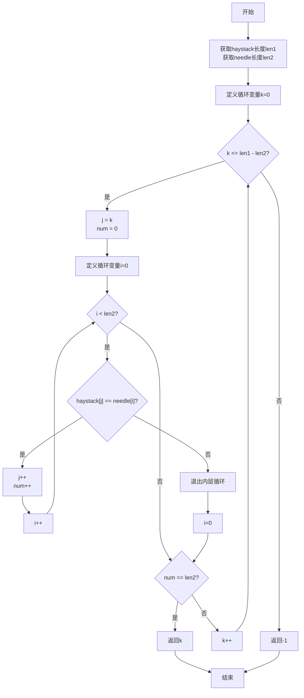

==模板：==

**题述：**


**示例 ：**

```

```

**框架：**

```c++

```

#### 解题思路1：

**思路解析:**


**题解：**

```c++

```

**复杂度分析**

- 时间复杂度：*O*()
- 空间复杂度：*O*()


# 1.基础实现

## 1.1 交替合并字符串

给你两个字符串 `word1` 和 `word2` 。请你从 `word1` 开始，通过交替添加字母来合并字符串。如果一个字符串比另一个字符串长，就将多出来的字母追加到合并后字符串的末尾。

返回 **合并后的字符串** 。

**示例 ：**

```
输入：word1 = "ab", word2 = "pqrs"
输出："apbqrs"
解释：注意，word2 比 word1 长，"rs" 需要追加到合并后字符串的末尾。
word1：  a   b 
word2：    p   q   r   s
合并后：  a p b q   r   s
```

**框架：**

```c++
class Solution {
public:
    string mergeAlternately(string word1, string word2) {
        
    }
};
```

### 解题思路1：循环

**确定已知字符串长度：**

```c++
int len1 = word1.length();
int len2 = word2.size();
```

**创建一个固定长度的新字符串：**

```c++
string ans;
ans.reserve(len1 + len2);
```

**对已知字符串进行添加操作：**

```c++
ans.push_back(word1[i]);
```

**题解：**

```c++
class Solution {
public:
    string mergeAlternately(string word1, string word2) 
    {
        int len1 = word1.length();   //字符串1的长度
        int len2 = word2.size();   //字符串2的长度
        int i = 0;              //指针1指向
        int j = 0;              //指针2指向
        string ans;             //保存的结果放入的地方
        ans.reserve(len1 + len2); //初始化保存字符串长度，避免多次动态分配
        while(i < len1 || j < len2)
        {
            if(i < len1)
            {
                ans.push_back(word1[i]);
                i++;
            }
            if(j < len2)
            {
                ans.push_back(word2[j]);
                j++;
            }
        }
        return ans;
    }
};
```

**复杂度分析**

时间复杂度：O(m+n)，其中 m 和 n 分别是字符串 word 1和 word 2的长度。

空间复杂度：O(1) 或 O(m+n)。如果使用的语言支持可修改的字符串，那么空间复杂度为 O(1)，否则为 O(m+n)。注意这里不计入返回值需要的空间。


## 1.2 找不同

给定两个字符串 `s` 和 `t` ，它们只包含小写字母。字符串 `t` 由字符串 `s` 随机重排，然后在随机位置添加一个字母。

请找出在 `t` 中被添加的字母。

**示例 ：**

```
输入：s = "abcd", t = "abcde"
输出："e"
解释：'e' 是那个被添加的字母。
```

**框架：**

```c++
class Solution {
public:
    char findTheDifference(string s, string t) {
        
    }
};
```

### 解题思路1：求和

使用求和，将字符串t的长度和-字符串2的长度和即可

**string类型字符串末尾没有 ' \0 '这个空字符 ** 

**for循环读入字符**

```c++
for(char ch: s)
    {
        as += ch;
    }
```

**题解：**

```c++
class Solution {
public:
    char findTheDifference(string s, string t) 
    {
        int as = 0, at =0;
        for(char ch: s)
        {
            as += ch;
        }
        for(char ch: t)
        {
            at += ch;
        }
        return at - as;
    }
};
```

**复杂度分析**

- 时间复杂度：*O*(*N*)。
- 空间复杂度：*O*(1)。


### 解题思路2：异或位运算

异或的性质

```
a ^ a = 0
a ^ 0 = a
```

示例流程：

```
输入：
s = "abcd"
t = "abcde"
过程1：
ret = 0
ret ^= 'a' -> ret = 'a'
ret ^= 'b' -> ret = ('a' ^ 'b')
ret ^= 'c' -> ret = ('a' ^ 'b' ^ 'c')
ret ^= 'd' -> ret = ('a' ^ 'b' ^ 'c' ^ 'd')
过程2：
ret ^= 'a' -> ret = ('a' ^ 'b' ^ 'c' ^ 'd' ^ 'a')
ret ^= 'b' -> ret = ('a' ^ 'b' ^ 'c' ^ 'd' ^ 'a' ^ 'b')
ret ^= 'c' -> ret = ('a' ^ 'b' ^ 'c' ^ 'd' ^ 'a' ^ 'b' ^ 'c')
ret ^= 'd' -> ret = ('a' ^ 'b' ^ 'c' ^ 'd' ^ 'a' ^ 'b' ^ 'c' ^ 'd')
ret ^= 'e' -> ret = ('a' ^ 'b' ^ 'c' ^ 'd' ^ 'a' ^ 'b' ^ 'c' ^ 'd' ^ 'e')
结果：
ret = 0 ^ 'e' = 'e'
```

题解代码：

```c++
class Solution {
public:
    char findTheDifference(string s, string t) {
        int ret = 0;
        for (char ch: s) {
            ret ^= ch;
        }
        for (char ch: t) {
            ret ^= ch;
        }
        return ret;
    }
};
```

**复杂度分析**

- 时间复杂度：*O*(N)
- 空间复杂度：*O*(1)


#### **位运算逻辑：**

###### **1. 与运算（AND, `&`）**

- **规则：** 两个位都为 `1` 时，结果为 `1`，否则为 `0`。
- **真值表：**

| A    | B    | A & B |
| ---- | ---- | ----- |
| 0    | 0    | 0     |
| 0    | 1    | 0     |
| 1    | 0    | 0     |
| 1    | 1    | 1     |

- 示例：

  ```
  A = 0101 (5)
  B = 0011 (3)
  A & B = 0001 (1)
  ```

###### **2. 或运算（OR, `|`）**

- **规则：** 只要有一位为 `1`，结果为 `1`；否则为 `0`。
- **真值表：**

| A    | B    | A    |
| ---- | ---- | ---- |
| 0    | 0    | 0    |
| 0    | 1    | 1    |
| 1    | 0    | 1    |
| 1    | 1    | 1    |

- 示例：

  ```
  A = 0101 (5)
  B = 0011 (3)
  A | B = 0111 (7)
  ```

###### **3. 非运算（NOT, `~`）**

- **规则：** 将位取反，`1` 变成 `0`，`0` 变成 `1`。

- **单目运算，无真值表。**

- 示例：

  ```
  A = 0101 (5)
  ~A = 1010 (-6)  // 注意：在计算机中，负数以补码形式存储。
  ```

###### **4. 异或运算（XOR, `^`）**

- **规则：** 两个位相同为 `0`，不同为 `1`。
- **真值表：**

| A    | B    | A ^ B |
| ---- | ---- | ----- |
| 0    | 0    | 0     |
| 0    | 1    | 1     |
| 1    | 0    | 1     |
| 1    | 1    | 0     |

- **性质：**

  - `a ^ a = 0` （自身异或为 0）
  - `a ^ 0 = a` （与 0 异或结果为自身）
  - 交换律：`a ^ b = b ^ a`
  - 结合律：`(a ^ b) ^ c = a ^ (b ^ c)`

- **示例：**

  复制

  ```
  A = 0101 (5)
  B = 0011 (3)
  A ^ B = 0110 (6)
  ```

### 解题思路3：vector计数

**vector容器：**

```c++
vector<int> cnt(26,0);
```

cnt可以理解为一个数组

**题解：**

```c++
class Solution {
public:
    char findTheDifference(string s, string t) {
        vector<int> cnt(26,0);   //定义一个整型容器，数量为26个，值为0
        //让字符串s中的每个字符与字符a相减，在对应的位置+1
        //局部变量只需要定义在for()中即可，否则会报错
        for(char ch: s)
        {
            cnt[ch - 'a']++;
        }
        //让字符串t中的每个字符与字符a相减，在对应的位置-1
        for(char ch: t)
        {
            cnt[ch - 'a']--;
            //如果cnt[?]的值为负数，则将这个字符输出
            if(cnt[ch - 'a'] < 0)
            {
                return ch;
            }
        }
        return ' ';	//在函数末尾添加一个默认的返回值，否则会报错
    }
};
```


## 1.3 找出字符串中第一个匹配项的下标

**题述：**

给你两个字符串 `haystack` 和 `needle` ，请你在 `haystack` 字符串中找出 `needle` 字符串的第一个匹配项的下标（下标从 0 开始）。如果 `needle` 不是 `haystack` 的一部分，则返回 `-1` 。

**示例 ：**

```
输入：haystack = "sadbutsad", needle = "sad"
输出：0
解释："sad" 在下标 0 和 6 处匹配。
```

**框架：**

```c++
class Solution {
public:
    int strStr(string haystack, string needle) {
       
    }
};
```


### 解法思路1：暴力求解

**题解：**

```c++
class Solution {
public:
    int strStr(string haystack, string needle) 
    {
        // 确定字符串长度
        int len1 = haystack.size();
        int len2 = needle.length();
        //定义循环次数
        int k = 0;
        for(k; k <= len1 - len2; k++)
        {
            int j = k;
            int num = 0;
            for(int i=0; i< len2; i++)
            {
                //如果又符合条件的值，则num==len2
                if(haystack[j] == needle[i])
                {
                    j++;
                    num++;
                }
                //如果在判断时有不符合的地方，则跳出这次循环进入下次循环
                else break;  
            }
            // 如果找到，返回下标
            if(num == len2)
            {
                return k;
            }
        }
        //遍历整条字符串都没找到，返回-1
        return -1;
    }
};
```

**程序流程图：**




### 解题思路2：KMP算法——后面在学


## 1.4 有效的字母异位词

**题述：**

给定两个字符串 `s` 和 `t` ，编写一个函数来判断 `t` 是否是 `s` 的 字母异位词。

**示例 ：**

```
示例 1:
输入: s = "anagram", t = "nagaram"
输出: true

示例 2:
输入: s = "rat", t = "car"
输出: false

提示:
1 <= s.length, t.length <= 5 * 10^4
s 和 t 仅包含小写字母
```

**框架：**

```c++
class Solution {
public:
    bool isAnagram(string s, string t) {
        
    }
};
```

### 解题思路1：暴力解放

思路解析：创建一个vector数组，让字符串s拥有的字符+1，让字符串t拥有的字符-1；最后如果vector数组全为0，那么就说明完全一样；否则就有不一样的

**题解：**

```c++
class Solution {
public:
    bool isAnagram(string s, string t) {
        vector<int> cnt(26,0);
        int len1 = s.size();
        int len2 = t.length();
        for(char ch: s)
        {
            cnt[ch - 'a']++;
        }
        for(char ch: t)
        {
            cnt[ch - 'a']--;
        }
        for(int i=0; i < 26 ;i++)
        {
            if(cnt[i] != 0)
            {
                return false;
            }
        }
        return true;
    }
};
```

**复杂度分析**

- 时间复杂度：*O*(N)
- 空间复杂度：*O*(1)

### 解题思路2：排序

**思路**：t 是 s 的异位词等价于「两个字符串排序后相等」。因此我们可以对字符串 s 和 t 分别排序，看排序后的字符串是否相等即可判断。此外，如果 s 和 t 的长度不同，t 必然不是 s 的异位词。

**题解：**

```c++
class Solution {
public:
    bool isAnagram(string s, string t) {
        if (s.length() != t.length()) {
            return false;
        }
        sort(s.begin(), s.end());
        sort(t.begin(), t.end());
        return s == t;
    }
};
```

**复杂度分析**

- 时间复杂度：*O*(n*logn)
- 空间复杂度：*O*(logn)

复杂度这里是为啥？

### 解题思路3：哈希表——后面在学

## 1.5 重复的子字符串

**题述：**

给定一个非空的字符串 `s` ，检查是否可以通过由它的一个子串重复多次构成。

**示例 ：**

```
示例 1:
输入: s = "abab"
输出: true
解释: 可由子串 "ab" 重复两次构成。

示例 2:
输入: s = "aba"
输出: false
示例 3:

输入: s = "abcabcabcabc"
输出: true
解释: 可由子串 "abc" 重复四次构成。 (或子串 "abcabc" 重复两次构成。)

提示：
1 <= s.length <= 104
s 由小写英文字母组成
```

**框架：**

```c++
class Solution {
public:
    bool repeatedSubstringPattern(string s) {
        
    }
};
```

### 解题思路1：枚举

**思路解析：**


**题解：**

```c++
class Solution {
public:
    bool repeatedSubstringPattern(string s) 
    {
        int n = s.size();
        for (int i = 1; i * 2 <= n; ++i) 
        {
            if (n % i == 0) 
            {
                bool match = true;
                for (int j = i; j < n; ++j) 
                {
                    if (s[j] != s[j - i]) 
                    {
                        match = false;
                        break;
                    }
                }
                if (match) 
                {
                    return true;
                }
            }
        }
        return false;
    }
};
```

**复杂度分析**

- 时间复杂度：*O*(n^2)
- 空间复杂度：*O*(1)


### 解题思路2：字符串匹配

**思路解析:**这个方法需要正确性证明，需要更加详细的解释，先用着把


**题解：**

```c++
class Solution {
public:
    bool repeatedSubstringPattern(string s) {
        return (s + s).find(s, 1) != s.size();
    }
};
```

**复杂度分析**：由于我们使用了语言自带的字符串查找函数，因此这里不深入分析其时空复杂度。


### 解题思路3：KMP算法

**思路解析:**


**题解：**

```c++

```

**复杂度分析**

- 时间复杂度：*O*()
- 空间复杂度：*O*()


### 解题思路4：优化的KMP算法

**思路解析:**


**题解：**

```c++

```

**复杂度分析**

- 时间复杂度：*O*()
- 空间复杂度：*O*()


## 1.6 移动零

**题述：**

给定一个数组 `nums`，编写一个函数将所有 `0` 移动到数组的末尾，同时保持非零元素的相对顺序。

请注意 ，必须在不复制数组的情况下原地对数组进行操作。

**示例 ：**

```
示例 1:
输入: nums = [0,1,0,3,12]
输出: [1,3,12,0,0]

示例 2:
输入: nums = [0]
输出: [0]
 
提示:
1 <= nums.length <= 104
-231 <= nums[i] <= 231 - 1
```

**框架：**

```c++
class Solution {
public:
    void moveZeroes(vector<int>& nums) {
        
    }
};
```

### 解题思路1：双指针

**思路解析:**

使用双指针，左指针指向当前已经处理好的序列的尾部，右指针指向待处理序列的头部。

右指针不断向右移动，每次右指针指向非零数，则将左右指针对应的数交换，同时左指针右移。

注意到以下性质：

- 左指针左边均为非零数；


- 右指针左边直到左指针处均为零。


因此每次交换，都是将左指针的零与右指针的非零数交换，且非零数的相对顺序并未改变。


**题解：**

```c++
class Solution {
public:
    void moveZeroes(vector<int>& nums) {
        int len1 = nums.size();
        int left = 0, right = 0;
        while(right < len1)
        {
            if(nums[right])
            {
                swap(nums[left], nums[right]);
                left++;
            }
            right++;
        }
    }
};
```

**复杂度分析**

- 时间复杂度：*O*(n)
- 空间复杂度：*O*(1)


## 1.7 加一

**题述：**

给定一个表示 **大整数** 的整数数组 `digits`，其中 `digits[i]` 是整数的第 `i` 位数字。这些数字按从左到右，从最高位到最低位排列。这个大整数不包含任何前导 `0`。

将大整数加 1，并返回结果的数字数组。

**示例 ：**

```
示例 1：
输入：digits = [1,2,3]
输出：[1,2,4]
解释：输入数组表示数字 123。
加 1 后得到 123 + 1 = 124。
因此，结果应该是 [1,2,4]。

示例 2：
输入：digits = [4,3,2,1]
输出：[4,3,2,2]
解释：输入数组表示数字 4321。
加 1 后得到 4321 + 1 = 4322。
因此，结果应该是 [4,3,2,2]。

示例 3：
输入：digits = [9]
输出：[1,0]
解释：输入数组表示数字 9。
加 1 得到了 9 + 1 = 10。
因此，结果应该是 [1,0]。
 

提示：
1 <= digits.length <= 100
0 <= digits[i] <= 9
digits 不包含任何前导 0。
```

**框架：**

```c++
class Solution {
public:
    vector<int> plusOne(vector<int>& digits) {
        
    }
};
```

### 解题思路1：寻找9的位置

**思路解析:**


**题解：**

```c++
class Solution {
public:
    vector<int> plusOne(vector<int>& digits) {
        //确定数组长度为len1
        int len1 = digits.size();
        for(int i = len1 - 1; i >= 0; --i)
        {
            //如果末尾不是9，那么末尾+1；否则就找到不是9的那一位
            if(digits[i] != 9)
            {
                digits[i]++;
                //从不是9的那一位的后面算起，全部设置为0
                for(int j = i + 1; j < len1; j++)
                {
                    digits[j] = 0;
                }
                return digits;
            }
        }
		//如果数组全为9，那么就将首位设置为1，其余设置为0
        vector<int> ans(len1 + 1);
        ans[0] = 1;
        return ans;
    }
};
```

**复杂度分析**

- 时间复杂度：*O*(n)
- 空间复杂度：*O*(1)


## 1.8 数组元素积的符号

**题述：**

已知函数 signFunc(x) 将会根据 x 的正负返回特定值：

如果 x 是正数，返回 1 。
如果 x 是负数，返回 -1 。
如果 x 是等于 0 ，返回 0 。
给你一个整数数组 nums 。令 product 为数组 nums 中所有元素值的乘积。

返回 signFunc(product) 。

**示例 ：**

```
示例 1：
输入：nums = [-1,-2,-3,-4,3,2,1]
输出：1
解释：数组中所有值的乘积是 144 ，且 signFunc(144) = 1

示例 2：
输入：nums = [1,5,0,2,-3]
输出：0
解释：数组中所有值的乘积是 0 ，且 signFunc(0) = 0

示例 3：
输入：nums = [-1,1,-1,1,-1]
输出：-1
解释：数组中所有值的乘积是 -1 ，且 signFunc(-1) = -1
 
提示：
1 <= nums.length <= 1000
-100 <= nums[i] <= 100
```

**框架：**

```c++
class Solution {
public:
    int arraySign(vector<int>& nums) {
       
    }
};
```

### 解题思路1：sign标识

**思路解析:**


**题解：**

```c++
class Solution {
public:
    int arraySign(vector<int>& nums) {
        int len1 = nums.size();
        int sign = 1;
        for(auto num: nums)
        {
            if(nums[i] < 0)
            {
                sign = - sign;
            }
            if(nums[i] == 0)
            {
                return 0;
            }
        }
        return sign;
    }
};
```

**复杂度分析**

- 时间复杂度：*O*(n)
- 空间复杂度：*O*(1)


## 1.9 判断能否形成等差数列

**题述：**

给你一个数字数组 `arr` 。

如果一个数列中，任意相邻两项的差总等于同一个常数，那么这个数列就称为 **等差数列** 。

如果可以重新排列数组形成等差数列，请返回 `true` ；否则，返回 `false` 。

**示例 ：**

```
示例 1：
输入：arr = [3,5,1]
输出：true
解释：对数组重新排序得到 [1,3,5] 或者 [5,3,1] ，任意相邻两项的差分别为 2 或 -2 ，可以形成等差数列。

示例 2：
输入：arr = [1,2,4]
输出：false
解释：无法通过重新排序得到等差数列。
 
提示：
2 <= arr.length <= 1000
-10^6 <= arr[i] <= 10^6
```

**框架：**

```c++
class Solution {
public:
    bool canMakeArithmeticProgression(vector<int>& arr) {
        
    }
};
```

### 解题思路1：先sort排序再验证

**思路解析:**

先排序，再验证是否为等差数列

**题解：**

```c++
class Solution {
public:
    bool canMakeArithmeticProgression(vector<int>& arr) {
        //先排序，再看是否为等差数列
        //1.数组排序
        int len1 = arr.size();
        sort(arr.begin(), arr.end());
        //2.看是否为等差数列
        int ret = arr[1] - arr[0];
        for(int i = 1; i < len1; ++i)
        {
            if((arr[i] - arr[i - 1]) != ret)
            {
                return false;
            }
        }
        return true;
    }
};
```

**复杂度分析**

- 时间复杂度：*O*(n * logn)
- 空间复杂度：*O*(logn)


## 1.10 单调数列

**题述：**

如果数组是单调递增或单调递减的，那么它是 **单调** *的*。

如果对于所有 `i <= j`，`nums[i] <= nums[j]`，那么数组 `nums` 是单调递增的。 如果对于所有 `i <= j`，`nums[i] >= nums[j]`，那么数组 `nums` 是单调递减的。

当给定的数组 `nums` 是单调数组时返回 `true`，否则返回 `false`。

**示例 ：**

```
示例 1：
输入：nums = [1,2,2,3]
输出：true

示例 2：
输入：nums = [6,5,4,4]
输出：true

示例 3：
输入：nums = [1,3,2]
输出：false
 
提示：
1 <= nums.length <= 105
-105 <= nums[i] <= 105
```

**框架：**

```c++
class Solution {
public:
    bool isMonotonic(vector<int>& nums) {
        
    }
};
```

### 解题思路1：for循环

**思路解析:**

increment：增加，decrement：减少

**题解：**

```c++
class Solution {
public:
    bool isMonotonic(vector<int>& nums) {
        bool inc = true, dec = true;
        int len1 = nums.size();
        for(int i = 1; i < len1; ++i)
        {
            if(nums[i] - nums[i - 1] < 0)
            {
                inc = false;
            }
            if(nums[i] - nums[i - 1] > 0)
            {
                dec = false;
            }
        }
        return inc || dec;
    }
};
```

**复杂度分析**

- 时间复杂度：*O*(n)
- 空间复杂度：*O*(1)


### 解题思路2：is_sorted()函数

**思路解析:**

is_sorted()函数，如果数组是递增的，则返回true；否则返回false

**题解：**

```c++
class Solution {
public:
    bool isMonotonic(vector<int>& nums) {
        return is_sorted(nums.begin(), nums.end()) || is_sorted(nums.rbegin(), nums.rend());
    }
};
```

**复杂度分析**

- 时间复杂度：*O*(n)
- 空间复杂度：*O*(1)


